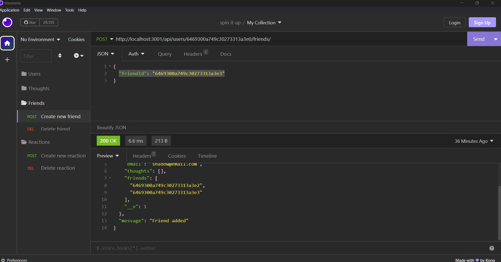

<header style="height: 100px; background: linear-gradient(to right, #000046, #1CB5E0);"><h1 style="font-size: 65px; text-align: center"><strong>Social Network API</strong></h1></header>

<br />

[](#license)


<br />

> # [Description](#description)
This server-side API routes for a social networking web app. It allows users to create, update and delete thoughts, as well as create, and delete reactions to other peoples thoughts. It offers the ability to add friends to a users account and delete a user and all associated thoughts as well.

<br />

---
<details>
<summary style="font-size: 25px">Table of Contents</summary> 

- [Description](#description)
- [Getting Started](#getting-started)
  - [Project Status](#project-status)
  - [Installation](#installation)
  - [Useage](#useage)
  - [Demonstration](#demonstration)
  - [Contributing Guidelines](#contributing)
  - [Test Instructions](#test) 
  - [License](#license)
- [Credits](#credits)
  - [Contributors](#contributors)
  - [Acknowledgements](#acknowledgements)
- [Questions](#questions)
</details>

<br />
<br />

---

> # [Getting Started](#getting-started)

<br />

## [Project Status](#project-status)
    MVP - Minimal Viable Product

<br />

*Because this project is not deployed on a live site yet, click on this [**LINK**](https://drive.google.com/file/d/1mlKcP4N2z00hUJPYBmw8iTNiAbQJuZnH/view) to get a walk through video of how to use the application.*

Or to get a better look at the code, please visit our GitHub repository: <a href="https://github.com/werthird/Social-Network-API-Module-18">Social Network API</a>


<br />

## [Installation](#installation)
No installation required. 


<br />

## [Useage](#useage)
Because this is not in a deployed site yet, this API is only able to be tested in Postman or Insomnia. 

After making a pull from the repo, building the database, and starting the server, open up Insomnia/Postman and run these routes to test the API.

### I. User Routes

  1. ```GET - http://localhost:3001/api/users/```
    <br />- Will get all users

  2. ```GET - http://localhost:3001/api/users/:userId```
    <br />- Get one user by ID, and any associated friends

  3. ```POST - http://localhost:3001/api/users/```
    <br />- Create a new user
    <br />- Required Format: ```{ "username": "username", "email": "email@email.com" }``` 

  4. ```PUT - http://localhost:3001/api/users/:userId```
    <br />- Update a users email
    <br />- Required Format: ```{ "email": "email@email.com" }``` 

  5. ```DELETE - http://localhost:3001/api/users/:userId```
    <br />- Delete a user

<br />

### II. Thought Routes

  1. ```GET - http://localhost:3001/api/thoughts/```
    <br />- Get all thoughts

  2. ```GET - http://localhost:3001/api/thoughts/:thoughtId```
    <br />- Get one thought, and any associated reactions

  3. ```POST - http://localhost:3001/api/thoughts/```
    <br />- Create a new thought, and updates the users thought record
    <br />- Required Format: ```{ "thoughtText": "thought text", "username": "username", "userId": "userId" }``` 

  4. ```PUT - http://localhost:3001/api/thoughts/:thoughtId```
    <br />- Update a thought
    <br />- Required Format: ```{ "thoughtText": "thought text" }```

  5. ```DELETE - http://localhost:3001/api/thoughts/:thoughtId```
    <br />- Delete a thought

<br />

### III. Friend Routes

  1. ```POST - http://localhost:3001/api/users/:userId/friends/```
    <br />- Adds a new friend to a user
    <br />- Required Format: ```{ "friendId": "6469300a749c30273313a3e3" }```

  2. ```DELETE - http://localhost:3001/api/users/:userId/friends/:friendId```
    <br />- Deletes a friend
    
<br />

### IV. Reaction Routes

  1. ```POST - http://localhost:3001/api/thoughts/:thoughtId/reactions/```
    <br />- Adds a new reaction to a thought
    <br />- Required Format: ```{ "reactionBody": "reaction text", "username": "username" }```

  2. ```DELETE - http://localhost:3001/api/thoughts/:thoughtId/reactions/:reactionId/```
    <br />- Deletes a reaction

<br />

<hr />

## [Demonstration](#demonstration)

<p>All Users API Route</p>


<br />
<p>Create User API Route</p>


<br />
<p>Update Thought API Route</p>


<br />
<p>Create Friend API Route</p>


<br />
<p>Create Reaction API Route</p>


<br />

## [Contributing Guidelines](#contributing)
No contributing guidelines. For any suggestions or comments, please see [Questions](#questions) section below.

<br />

## [Test Instructions](#test)
No testing instructions at this time.

<br />

## [License](#license)
Distributed under the MIT License. See LICENSE.txt for more information.

<br />
<br />

---

> # [Credits](#credits)

<br />

## [Contributors](#contributors)

Designed and built by Devin Reilly

<br />

## [Acknowledgements](#acknowledgements)
- [The Full-Stack Blog](https://coding-boot-camp.github.io/full-stack/github/professional-readme-guide) - README Template 
- UCF Instructor **John Dinsmore**, and TA's, **Kristofer Marshall** and **Rider Cogswell**
- Students of UCF Coding Boot Camp, in class, on Slack and on Discord
- Research articles from Google Search, ChatGPT, MDN Docs, W3Schools

<br />
<br />

---

> # [Questions](#questions)

Here is a link to our <a href="https://github.com/werthird">GitHub profile page!</a>

Or send us an <a href="mailto: werthird@aol.com?subject=Tech Blog Feedback">Email!</a>